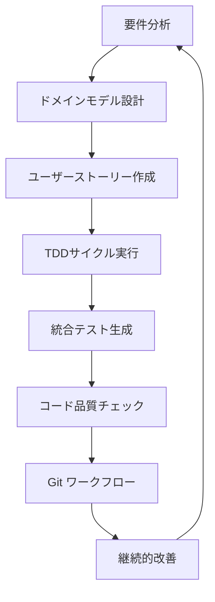

# AI駆動開発ワークフローコマンド

## 概要
AI駆動開発における各フェーズで実行するコマンドと具体的なワークフロー定義

## フェーズ別コマンド

### Phase 1: 要件定義・設計（人メイン・AI補助）

#### `analyze_requirements`
ビジネス要件の分析と整理を支援する

**使用例:**
```
$analyze_requirements$
```

**実行内容:**
1. ステークホルダー要件の整合性確認
2. 機能要件・非機能要件の分離
3. 優先度付けの妥当性チェック
4. 抜け漏れの指摘
5. 類似プロジェクトからの知見提供

**出力例:**
```markdown
## 要件分析結果
### 整合性チェック
- ✅ ユーザーストーリー間の矛盾なし
- ⚠️  パフォーマンス要件の具体性不足
- ❌ セキュリティ要件が未定義

### 優先度妥当性
- Critical: ユーザー認証機能
- High: データ暗号化
- Medium: UI改善
- Low: レポート機能

### 類似プロジェクト知見
- 認証システム: JWT + リフレッシュトークン推奨
- データ保護: AES-256 + RBAC実装例
```

#### `design_domain_model`
DDD手法によるドメインモデル設計を支援する

**使用例:**
```
$design_domain_model$
```

**実行内容:**
1. ドメインイベントの抽出
2. エンティティ・値オブジェクトの提案
3. アグリゲート境界の推奨
4. ユビキタス言語の候補生成
5. 境界づけられたコンテキストの提案

**DDD設計パターン:**
```typescript
// Entity Example
export class User {
  private constructor(
    private readonly id: UserId,
    private email: Email,
    private password: HashedPassword
  ) {}

  static create(email: string, password: string): User {
    return new User(
      UserId.generate(),
      Email.create(email),
      HashedPassword.create(password)
    );
  }

  changeEmail(newEmail: string): void {
    this.email = Email.create(newEmail);
    // Domain Event
    DomainEvents.raise(new UserEmailChangedEvent(this.id, this.email));
  }
}

// Value Object Example
export class Email {
  private constructor(private readonly value: string) {
    if (!this.isValid(value)) {
      throw new InvalidEmailError(value);
    }
  }

  static create(value: string): Email {
    return new Email(value);
  }

  private isValid(email: string): boolean {
    return /^[^\s@]+@[^\s@]+\.[^\s@]+$/.test(email);
  }
}
```

#### `create_user_stories`
アジャイル開発のユーザーストーリー作成を支援する

**使用例:**
```
$create_user_stories$
```

**実行内容:**
1. 要件からのユーザーストーリー生成
2. 受け入れ条件の提案
3. ストーリーポイント見積もり支援
4. 依存関係の分析
5. スプリント分割の提案

**ユーザーストーリーテンプレート:**
```markdown
## Epic: ユーザー認証システム

### Story 1: ユーザー登録
**As a** 新規ユーザー
**I want** アカウントを作成したい
**So that** サービスを利用できる

#### 受け入れ条件
- [ ] メールアドレスとパスワードで登録可能
- [ ] パスワードは8文字以上、英数字記号を含む
- [ ] 重複メールアドレスはエラーとなる
- [ ] 登録後に確認メールが送信される

#### Story Points: 5
#### Dependencies: なし

### Story 2: ログイン機能
**As a** 登録済みユーザー
**I want** ログインしたい
**So that** 個人向け機能を利用できる

#### 受け入れ条件
- [ ] メールアドレスとパスワードでログイン
- [ ] 認証失敗時は適切なエラーメッセージ
- [ ] ログイン状態の保持（セッション管理）
- [ ] ログアウト機能

#### Story Points: 3
#### Dependencies: Story 1
```

### Phase 2: 実装・テスト（AIメイン・人補助）

#### `implement_tdd_cycle`
テスト駆動開発のサイクルを実行する

**使用例:**
```
$implement_tdd_cycle$
```

**実行内容:**
1. 要件からテストケース生成
2. 失敗するテストコード作成
3. 最小実装コード生成
4. リファクタリング提案
5. 次のテストケース提案

**TDDサイクル例:**
```typescript
// Red: 失敗するテスト
describe('User', () => {
  it('should create user with valid email and password', () => {
    const email = 'test@example.com';
    const password = 'securePassword123!';
    
    const user = User.create(email, password);
    
    expect(user.getEmail()).toBe(email);
    expect(user.isActive()).toBe(true);
  });
  
  it('should throw error for invalid email', () => {
    const invalidEmail = 'invalid-email';
    const password = 'securePassword123!';
    
    expect(() => User.create(invalidEmail, password))
      .toThrow(InvalidEmailError);
  });
});

// Green: 最小実装
export class User {
  constructor(
    private email: string,
    private password: string,
    private active: boolean = true
  ) {
    if (!this.isValidEmail(email)) {
      throw new InvalidEmailError(email);
    }
  }

  static create(email: string, password: string): User {
    return new User(email, password);
  }

  getEmail(): string {
    return this.email;
  }

  isActive(): boolean {
    return this.active;
  }

  private isValidEmail(email: string): boolean {
    return email.includes('@') && email.includes('.');
  }
}

// Refactor: 改善提案
// 1. Email値オブジェクトの分離
// 2. パスワードハッシュ化
// 3. より厳密なバリデーション
```

#### `generate_integration_tests`
統合テストの生成と実行を支援する

**使用例:**
```
$generate_integration_tests$
```

**実行内容:**
1. API エンドポイントテスト生成
2. データベース統合テスト作成
3. 外部サービス連携テスト
4. エラーシナリオテスト
5. パフォーマンステスト

**統合テスト例:**
```typescript
// API Integration Test
describe('User API Integration', () => {
  beforeEach(async () => {
    await setupTestDatabase();
  });

  afterEach(async () => {
    await cleanupTestDatabase();
  });

  describe('POST /api/users', () => {
    it('should create user successfully', async () => {
      const userData = {
        email: 'test@example.com',
        password: 'securePassword123!'
      };

      const response = await request(app)
        .post('/api/users')
        .send(userData)
        .expect(201);

      expect(response.body).toMatchObject({
        id: expect.any(String),
        email: userData.email,
        active: true
      });

      // Database verification
      const savedUser = await userRepository.findByEmail(userData.email);
      expect(savedUser).toBeDefined();
      expect(savedUser.email).toBe(userData.email);
    });

    it('should return 400 for duplicate email', async () => {
      const userData = {
        email: 'duplicate@example.com',
        password: 'securePassword123!'
      };

      // Create first user
      await request(app).post('/api/users').send(userData);

      // Attempt duplicate
      const response = await request(app)
        .post('/api/users')
        .send(userData)
        .expect(400);

      expect(response.body.error).toContain('Email already exists');
    });
  });
});
```

#### `git_workflow_automation`
Git駆動開発のワークフローを自動化する

**使用例:**
```
$git_workflow_automation$
```

**実行内容:**
1. ブランチ命名規則チェック
2. コミットメッセージ生成
3. プルリクエスト説明生成
4. 自動品質チェック実行
5. マージ準備チェック

**Git ワークフロー例:**
```bash
#!/bin/bash
# AI-Enhanced Git Workflow

# 1. Feature branch creation
create_feature_branch() {
  local issue_id=$1
  local feature_name=$2
  
  # AI: ブランチ名提案
  local branch_name="feature/${issue_id}-${feature_name}"
  
  git checkout -b "$branch_name"
  echo "Created feature branch: $branch_name"
}

# 2. AI-assisted commit
ai_commit() {
  # AI: 変更内容分析とコミットメッセージ生成
  local changes=$(git diff --cached --name-only)
  local commit_type=$(analyze_commit_type "$changes")
  local commit_scope=$(analyze_commit_scope "$changes")
  local commit_message=$(generate_commit_message "$changes")
  
  echo "Suggested commit: ${commit_type}(${commit_scope}): ${commit_message}"
  read -p "Use this commit message? (y/n): " -n 1 -r
  
  if [[ $REPLY =~ ^[Yy]$ ]]; then
    git commit -m "${commit_type}(${commit_scope}): ${commit_message}"
  else
    git commit
  fi
}

# 3. Pre-PR quality check
pre_pr_check() {
  echo "Running pre-PR quality checks..."
  
  # Lint check
  npm run lint || { echo "Lint failed"; exit 1; }
  
  # Type check
  npm run type-check || { echo "Type check failed"; exit 1; }
  
  # Unit tests
  npm run test || { echo "Tests failed"; exit 1; }
  
  # Security audit
  npm audit --audit-level moderate || { echo "Security vulnerabilities found"; exit 1; }
  
  echo "All quality checks passed!"
}

# 4. AI-generated PR description
generate_pr_description() {
  local base_branch=${1:-main}
  local commits=$(git log ${base_branch}..HEAD --oneline)
  local files_changed=$(git diff ${base_branch}..HEAD --name-only)
  
  cat << EOF
## Changes
$(analyze_changes "$commits" "$files_changed")

## Testing
- [ ] Unit tests added/updated
- [ ] Integration tests added/updated
- [ ] Manual testing completed

## Checklist
- [ ] Code follows style guidelines
- [ ] Self-review completed
- [ ] Documentation updated
- [ ] No breaking changes (or documented)

## AI Analysis
$(ai_analyze_changes "$commits" "$files_changed")
EOF
}
```

### Phase 3: 継続的改善

#### `continuous_quality_improvement`
継続的な品質改善を実行する

**使用例:**
```
$continuous_quality_improvement$
```

**実行内容:**
1. コード品質メトリクス分析
2. 技術的負債の特定
3. パフォーマンス最適化提案
4. セキュリティ強化提案
5. 改善ロードマップ作成

#### `agile_metrics_analysis`
アジャイル開発のメトリクス分析を実行する

**使用例:**
```
$agile_metrics_analysis$
```

**実行内容:**
1. ベロシティ分析
2. バーンダウン・バーンアップ分析
3. サイクルタイム測定
4. 品質メトリクス追跡
5. 改善提案生成

**メトリクス例:**
```markdown
## Sprint 5 Metrics Analysis

### Velocity
- Previous 3 sprints average: 24 story points
- Current sprint: 28 story points (+17%)
- Trend: Improving ↗️

### Quality Metrics
- Bug rate: 0.8 bugs/story point (Target: < 1.0) ✅
- Test coverage: 85% (Target: > 80%) ✅
- Code review time: 4.2 hours avg (Target: < 8 hours) ✅

### Cycle Time Analysis
- Development: 2.1 days avg
- Code Review: 0.5 days avg
- Testing: 1.2 days avg
- Total: 3.8 days avg

### Improvement Recommendations
1. **Parallel Review Process**: 並行レビューで0.2日短縮可能
2. **Automated Testing**: E2Eテスト自動化で0.3日短縮可能
3. **Knowledge Sharing**: ペアプロで品質向上期待
```

## ワークフロー統合コマンド

#### `execute_ai_development_cycle`
AI駆動開発の完全サイクルを実行する

**使用例:**
```
$execute_ai_development_cycle$
```

**実行フロー:**


#### `setup_ai_project`
新規プロジェクトのAI駆動開発環境を構築する

**使用例:**
```
$setup_ai_project$
```

**実行内容:**
1. プロジェクト構造作成
2. AI開発ツール設定
3. 品質ゲート設定
4. CI/CDパイプライン構築
5. 監視・メトリクス設定

## ベストプラクティス

### AI協働開発の原則
```markdown
## Golden Rules
1. **Human-AI Partnership**: AIは拡張、人は判断
2. **Iterative Improvement**: 小さなサイクルで継続改善
3. **Quality First**: 速度より品質を優先
4. **Transparency**: AI判断の可視化・説明
5. **Continuous Learning**: フィードバックループの構築
```

### 推奨ツールスタック
```markdown
## AI Development Stack
- **AI Assistant**: GitHub Copilot, Claude, ChatGPT
- **Code Quality**: SonarQube, CodeClimate
- **Testing**: Jest, Cypress, Playwright  
- **CI/CD**: GitHub Actions, Jenkins
- **Monitoring**: Sentry, DataDog, Prometheus
```