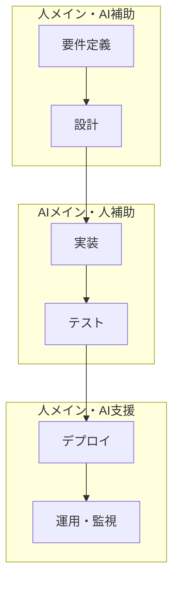

# AI駆動開発フロー

## 概要
AIを活用した効率的な開発プロセスのガイドライン。人間とAIの役割分担を明確にし、品質と速度を両立する。

## 全体フロー

### フェーズ分担


## Phase 1: 要件定義・設計（人メイン・AI補助）

### 1.1 ビジネス要件整理
**人の役割（Primary）**
- ステークホルダーとの対話
- ビジネス価値の定義
- 優先度の決定
- 制約条件の特定

**AIの役割（Assistant）**
- 要件の整合性チェック
- 類似プロジェクトからの知見提供
- 抜け漏れの指摘
- ドキュメント生成支援

**成果物**
```markdown
## ビジネス要件書
- [ ] プロジェクト目的・背景
- [ ] 対象ユーザー定義
- [ ] 成功指標（KPI）
- [ ] 制約条件・前提条件
- [ ] 優先度付きフィーチャーリスト

## AIコマンド活用
$domain_knowledge_commands$ - ドメイン知識の整理
$documentation_commands$ - 要件書生成
```

### 1.2 ユーザーストーリー作成
**人の役割（Primary）**
- ユーザーペルソナ定義
- ユーザージャーニー設計
- 受け入れ条件定義
- ストーリーポイント見積もり

**AIの役割（Assistant）**
- ストーリー形式の提案
- エッジケースの洗い出し
- テストシナリオ生成
- 依存関係の分析

**アジャイル実践**
```markdown
## User Story Template
As a [ユーザータイプ]
I want [やりたいこと]
So that [得たい価値]

### 受け入れ条件
- [ ] [条件1]
- [ ] [条件2]
- [ ] [条件3]

### Definition of Done
- [ ] 実装完了
- [ ] ユニットテスト追加
- [ ] コードレビュー完了
- [ ] 受け入れテスト通過
```

### 1.3 ドメインモデリング（DDD）
**人の役割（Primary）**
- ドメインエキスパートとの対話
- 境界づけられたコンテキスト定義
- アグリゲート設計
- ユビキタス言語策定

**AIの役割（Assistant）**
- エンティティ・値オブジェクト提案
- ドメインサービス候補抽出
- アンチパターンの検出
- DDDパターン適用提案

**DDD実践フロー**
```markdown
## ドメイン分析
1. **Event Storming**
   - ドメインイベントの洗い出し
   - コマンド・アクターの特定
   - アグリゲートの境界決定

2. **境界づけられたコンテキスト**
   - サブドメインの分離
   - コンテキストマップ作成
   - 統合パターンの決定

3. **戦術的設計**
   - エンティティ設計
   - 値オブジェクト設計
   - ドメインサービス設計
   - リポジトリ設計
```

### 1.4 アーキテクチャ設計
**人の役割（Primary）**
- アーキテクチャパターン選択
- 技術スタック決定
- 非機能要件定義
- セキュリティ要件設計

**AIの役割（Assistant）**
- アーキテクチャパターン提案
- 技術選択の根拠提供
- パフォーマンス影響分析
- セキュリティリスク評価

**設計パターン**
```markdown
## Clean Architecture + DDD
src/
├── domain/          # ドメイン層
│   ├── entities/
│   ├── value-objects/
│   ├── services/
│   └── repositories/
├── application/     # アプリケーション層
│   ├── use-cases/
│   ├── dto/
│   └── services/
├── infrastructure/ # インフラ層
│   ├── repositories/
│   ├── external-apis/
│   └── database/
└── presentation/   # プレゼンテーション層
    ├── controllers/
    ├── middleware/
    └── routes/
```

## Phase 2: 実装・テスト（AIメイン・人補助）

### 2.1 AI駆動実装
**AIの役割（Primary）**
- 仕様からのコード生成
- テスト駆動開発支援
- リファクタリング提案
- コード最適化

**人の役割（Oversight）**
- 生成コードのレビュー
- 設計判断・方針決定
- 複雑なビジネスロジック実装
- アーキテクチャ整合性確認

**AI実装フロー**
```markdown
## 1. TDD with AI
### Red Phase
$task_implementation_commands$ 
- テストケース生成
- エッジケース特定
- モック設定

### Green Phase  
$task_implementation_commands$
- 最小実装生成
- テスト通過確認
- 即座のフィードバック

### Refactor Phase
$code_analysis_commands$
- コード品質分析
- リファクタリング提案
- パフォーマンス最適化
```

### 2.2 継続的品質改善
**AIの役割（Primary）**
- 静的解析・品質測定
- セキュリティ脆弱性検出
- パフォーマンス分析
- 自動化テスト生成

**人の役割（Oversight）**
- 品質基準の設定
- レビュー観点の決定
- 重要な判断・承認
- チーム知識共有

**品質管理フロー**
```markdown
## 継続的品質改善
### 自動チェック
$code_analysis_commands$
- ESLint/Prettier
- TypeScript型チェック
- セキュリティスキャン
- テストカバレッジ

### コードレビュー
$code_review_commands$
- AI事前レビュー
- 人による最終確認
- 知識共有・メンタリング
- 継続的改善提案
```

### 2.3 Git駆動開発
**ブランチ戦略**
```markdown
## Feature Branch Flow + AI
1. **Issue/User Story作成**
   - GitHub Issues with templates
   - AI によるタスク分解提案

2. **Feature Branch作成**
   ```bash
   git checkout -b feature/user-auth-implementation
   # AI: ブランチ命名規則チェック
   ```

3. **AI駆動実装**
   ```bash
   # AI assisted development
   $task_implementation_commands$
   
   # 小さなコミット
   git add .
   git commit -m "feat: implement user authentication logic"
   ```

4. **プルリクエスト**
   ```bash
   # AI generated PR description
   $code_review_commands$
   
   # 自動品質チェック
   $code_analysis_commands$
   ```

5. **レビュー・マージ**
   - AI事前レビュー
   - 人によるファイナルレビュー
   - 自動デプロイ
```

## Phase 3: デプロイ・運用（人メイン・AI支援）

### 3.1 デプロイメント
**人の役割（Primary）**
- デプロイ戦略決定
- 本番環境判断
- 緊急時対応
- ビジネス影響評価

**AIの役割（Support）**
- デプロイスクリプト生成
- 設定ファイル検証
- 健全性チェック
- 自動ロールバック提案

### 3.2 監視・運用
**人の役割（Primary）**
- 監視基準設定
- アラート対応
- 障害対応判断
- ビジネス影響分析

**AIの役割（Support）**
- 異常検知・予測
- ログ分析・パターン発見
- 自動復旧提案
- レポート生成

## アジャイル実践との統合

### スプリント計画
```markdown
## AI-Enhanced Sprint Planning
### 見積もり
- AI: 類似タスクからの工数予測
- 人: 複雑さ・リスクの評価

### タスク分解
- AI: ユーザーストーリーの技術タスク分解
- 人: 優先度・依存関係の整理

### スプリント目標
- 人: ビジネス価値の定義
- AI: 達成可能性の分析
```

### デイリースタンドアップ
```markdown
## Enhanced Daily Standup
### 昨日の実績
- 人: 完了したタスク報告
- AI: 生産性・品質メトリクス提供

### 今日の予定  
- 人: 作業予定の共有
- AI: タスクの優先度・依存関係提示

### ブロッカー
- 人: 障害・課題の報告
- AI: 解決策・代替案の提案
```

### レトロスペクティブ
```markdown
## AI-Supported Retrospective
### データドリブン振り返り
- AI: 客観的メトリクス提示
  - コード品質の変化
  - 生産性の推移
  - バグ発生率
- 人: 主観的体験の共有
  - チーム協力
  - 学習・成長
  - やりがい

### 改善アクション
- AI: データに基づく改善提案
- 人: チーム文化・プロセス改善
```

## 成功の測定

### 技術指標
```markdown
## AI効果測定
- **開発速度**: ストーリーポイント/スプリント
- **品質**: バグ検出率、テストカバレッジ
- **保守性**: コード複雑度、技術的負債
- **セキュリティ**: 脆弱性検出・修正時間
```

### ビジネス指標  
```markdown
## ビジネス価値測定
- **Time to Market**: アイデアから本番リリースまで
- **Customer Satisfaction**: ユーザー満足度
- **Feature Adoption**: 新機能の利用率
- **ROI**: 開発投資対効果
```

## 注意点・ベストプラクティス

### AI活用の原則
```markdown
## Do's
✅ AIを創造性を拡張するツールとして活用
✅ 人間の判断・創造性を最重視
✅ 継続的な学習・改善
✅ 透明性・説明可能性の確保

## Don'ts
❌ AIに完全依存
❌ 人間の思考停止
❌ ブラックボックス化
❌ 品質基準の妥協
```

### チーム体制
```markdown
## 推奨ロール
- **Product Owner**: ビジネス価値・優先度判断
- **Tech Lead**: アーキテクチャ・技術判断  
- **Developer**: AI協働開発・レビュー
- **QA Engineer**: 品質基準・テスト戦略
- **DevOps Engineer**: インフラ・デプロイ戦略
```