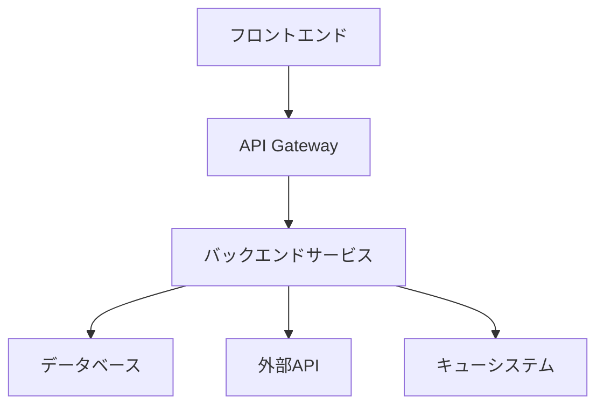

# 機能仕様書テンプレート

## 概要
新機能開発時の仕様書作成テンプレート

## 機能概要

### 機能名
[機能名を記入]

### 目的・背景
- **ビジネス価値**: [この機能がもたらす価値]
- **ユーザーニーズ**: [ユーザーが抱える課題]
- **解決方法**: [どのように課題を解決するか]

### 対象ユーザー
- **プライマリ**: [主要なユーザー]
- **セカンダリ**: [副次的なユーザー]

## 要件定義

### 機能要件

#### 基本機能
1. **[機能1]**
   - 説明: [機能の詳細説明]
   - 入力: [必要な入力情報]
   - 処理: [実行される処理]
   - 出力: [期待される結果]

2. **[機能2]**
   - 説明: [機能の詳細説明]
   - 入力: [必要な入力情報]
   - 処理: [実行される処理]
   - 出力: [期待される結果]

#### 詳細機能
```markdown
## 機能詳細
### [機能名]
- **ID**: F001
- **優先度**: High/Medium/Low
- **複雑度**: Simple/Medium/Complex
- **工数見積**: [人日]

#### 処理フロー
1. [ステップ1の説明]
2. [ステップ2の説明]
3. [ステップ3の説明]

#### 入力検証
- [検証項目1]: [検証内容]
- [検証項目2]: [検証内容]

#### エラーハンドリング
- [エラーケース1]: [対応方法]
- [エラーケース2]: [対応方法]
```

### 非機能要件

#### パフォーマンス
- **応答時間**: [具体的な時間]
- **スループット**: [処理件数/秒]
- **同時接続数**: [最大同時接続数]
- **データ量**: [想定データサイズ]

#### セキュリティ
- **認証**: [認証方式]
- **認可**: [権限制御方法]
- **データ保護**: [暗号化・マスキング]
- **監査ログ**: [ログ出力内容]

#### 可用性
- **稼働率**: [目標稼働率]
- **復旧時間**: [障害発生時の復旧目標]
- **バックアップ**: [バックアップ頻度・方法]

#### 拡張性
- **ユーザー数**: [想定ユーザー数の増加]
- **データ増加**: [データ量の増加対応]
- **機能拡張**: [将来の機能追加への対応]

## ユーザーストーリー

### エピック
```
As a [ユーザータイプ]
I want [やりたいこと]
So that [得たい価値]
```

### 詳細ストーリー
```markdown
## Story 1: [ストーリー名]
**As a** [ユーザー]
**I want** [機能]
**So that** [目的]

### 受け入れ条件
- [ ] [条件1]
- [ ] [条件2]
- [ ] [条件3]

### 定義完了（DoD）
- [ ] 実装完了
- [ ] ユニットテスト作成
- [ ] 統合テスト実施
- [ ] コードレビュー完了
- [ ] ドキュメント更新
```

## UI/UX設計

### 画面構成
```markdown
## 画面一覧
1. [画面名1] - [画面の説明]
2. [画面名2] - [画面の説明]
3. [画面名3] - [画面の説明]

## 画面遷移図
[Mermaid図やFigmaリンク]
```

### ワイヤーフレーム
```markdown
## [画面名]
### レイアウト
- ヘッダー: [内容]
- メインコンテンツ: [内容]
- サイドバー: [内容]
- フッター: [内容]

### 操作要素
- ボタン: [配置と機能]
- フォーム: [入力項目]
- ナビゲーション: [メニュー構成]

### レスポンシブ対応
- モバイル: [レイアウト変更点]
- タブレット: [レイアウト変更点]
- デスクトップ: [標準レイアウト]
```

### デザインシステム
```markdown
## カラーパレット
- Primary: #[カラーコード]
- Secondary: #[カラーコード]
- Success: #[カラーコード]
- Warning: #[カラーコード]
- Error: #[カラーコード]

## タイポグラフィ
- Heading 1: [フォント、サイズ、重み]
- Heading 2: [フォント、サイズ、重み]
- Body: [フォント、サイズ、重み]
- Caption: [フォント、サイズ、重み]

## コンポーネント
- Button: [バリエーション]
- Input: [種類]
- Card: [デザイン]
- Modal: [デザイン]
```

## 技術仕様

### システム構成


### データモデル
```sql
-- テーブル設計例
CREATE TABLE users (
    id SERIAL PRIMARY KEY,
    email VARCHAR(255) UNIQUE NOT NULL,
    password_hash VARCHAR(255) NOT NULL,
    created_at TIMESTAMP DEFAULT CURRENT_TIMESTAMP,
    updated_at TIMESTAMP DEFAULT CURRENT_TIMESTAMP
);

CREATE TABLE [機能関連テーブル] (
    id SERIAL PRIMARY KEY,
    user_id INTEGER REFERENCES users(id),
    [カラム名] [データ型] [制約],
    created_at TIMESTAMP DEFAULT CURRENT_TIMESTAMP
);
```

### API設計
```yaml
# OpenAPI仕様例
paths:
  /api/[エンドポイント]:
    get:
      summary: [機能の説明]
      parameters:
        - name: [パラメータ名]
          in: query
          required: true
          schema:
            type: string
      responses:
        '200':
          description: 成功
          content:
            application/json:
              schema:
                type: object
                properties:
                  data:
                    type: array
                    items:
                      $ref: '#/components/schemas/[スキーマ名]'
    
    post:
      summary: [作成機能の説明]
      requestBody:
        required: true
        content:
          application/json:
            schema:
              $ref: '#/components/schemas/[リクエストスキーマ]'
      responses:
        '201':
          description: 作成成功
```

### 状態管理
```typescript
// Zustand store 例
interface [機能名]Store {
  // State
  [データ名]: [型];
  loading: boolean;
  error: string | null;
  
  // Actions
  fetch[データ名]: () => Promise<void>;
  create[データ名]: (data: [型]) => Promise<void>;
  update[データ名]: (id: string, data: Partial<[型]>) => Promise<void>;
  delete[データ名]: (id: string) => Promise<void>;
  clearError: () => void;
}
```

## テスト仕様

### テスト戦略
```markdown
## テストレベル
1. **ユニットテスト**: 個別関数・コンポーネント
2. **統合テスト**: API・データベース連携
3. **E2Eテスト**: ユーザーシナリオ
4. **パフォーマンステスト**: 負荷・応答時間

## カバレッジ目標
- ユニットテスト: 80%以上
- 統合テスト: 主要パス100%
- E2Eテスト: クリティカルパス100%
```

### テストケース
```markdown
## [機能名] テストケース

### 正常系
| テストID | テスト内容 | 入力 | 期待結果 |
|---------|-----------|------|----------|
| TC001   | [テスト内容] | [入力値] | [期待値] |
| TC002   | [テスト内容] | [入力値] | [期待値] |

### 異常系
| テストID | テスト内容 | 入力 | 期待結果 |
|---------|-----------|------|----------|
| TC101   | [エラーケース] | [不正入力] | [エラー内容] |
| TC102   | [エラーケース] | [不正入力] | [エラー内容] |

### 境界値
| テストID | テスト内容 | 入力 | 期待結果 |
|---------|-----------|------|----------|
| TC201   | [境界値テスト] | [境界値] | [期待値] |
```

## 実装計画

### タスク分割
```markdown
## フェーズ1: 基盤実装（[期間]）
- [ ] データモデル設計・実装
- [ ] API基盤構築
- [ ] 認証・認可機能
- [ ] 基本的なCRUD操作

## フェーズ2: コア機能実装（[期間]）
- [ ] [主要機能1]の実装
- [ ] [主要機能2]の実装
- [ ] エラーハンドリング強化
- [ ] バリデーション実装

## フェーズ3: UI/UX実装（[期間]）
- [ ] 画面コンポーネント作成
- [ ] レスポンシブ対応
- [ ] アクセシビリティ対応
- [ ] パフォーマンス最適化

## フェーズ4: テスト・リリース（[期間]）
- [ ] 包括的テスト実施
- [ ] ドキュメント整備
- [ ] デプロイ準備
- [ ] 本番リリース
```

### リスクと対策
```markdown
## 技術的リスク
| リスク | 影響度 | 発生確率 | 対策 |
|--------|--------|----------|------|
| [リスク1] | High/Medium/Low | High/Medium/Low | [対策内容] |
| [リスク2] | High/Medium/Low | High/Medium/Low | [対策内容] |

## スケジュールリスク
| リスク | 影響度 | 発生確率 | 対策 |
|--------|--------|----------|------|
| [リスク1] | High/Medium/Low | High/Medium/Low | [対策内容] |
```

## 運用・保守

### 監視項目
```markdown
## アプリケーション監視
- エラー率: [閾値]
- 応答時間: [閾値]
- スループット: [閾値]
- リソース使用率: [閾値]

## ビジネス監視
- 利用状況: [指標]
- ユーザー行動: [指標]
- 変換率: [指標]
```

### 保守計画
```markdown
## 定期メンテナンス
- 日次: [作業内容]
- 週次: [作業内容]
- 月次: [作業内容]

## アップデート計画
- セキュリティパッチ: [頻度・方法]
- 機能アップデート: [頻度・方法]
- 依存関係更新: [頻度・方法]
```

## 承認・レビュー

### レビュー項目
- [ ] 要件の網羅性
- [ ] 技術的実現可能性
- [ ] セキュリティ考慮
- [ ] パフォーマンス考慮
- [ ] 保守性・拡張性
- [ ] テスト十分性

### 承認者
- **ビジネス要件**: [承認者名]
- **技術仕様**: [承認者名]
- **セキュリティ**: [承認者名]
- **UI/UX**: [承認者名]

### 承認履歴
| 日付 | 承認者 | 承認内容 | コメント |
|------|--------|----------|----------|
| [日付] | [名前] | [項目] | [コメント] |