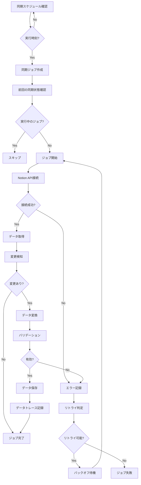

# 同期ワークフロー

## 概要
Notionデータの同期処理に関する詳細なワークフロー

## 同期ジョブの実行フロー



## 詳細な処理ステップ

### 1. スケジュール確認
- Cronジョブまたはキューシステムでトリガー
- 各ワークスペースの同期スケジュールを確認
- 実行対象のジョブをキューに追加

### 2. ジョブの初期化
```typescript
// 同期ジョブの作成
const job = new SyncJob({
  workspaceId,
  integrationId,
  databaseId,
  status: 'pending',
  startedAt: new Date()
});
```

### 3. 前回同期の確認
- 最後の成功した同期時刻を取得
- 実行中のジョブがないことを確認
- 重複実行の防止

### 4. Notion API接続
- 統合トークンを復号化
- API接続を確立
- 接続エラーの処理

### 5. データ取得
```typescript
// ページネーション対応
let hasMore = true;
let cursor = undefined;
const pages = [];

while (hasMore) {
  const response = await notion.databases.query({
    database_id: databaseId,
    start_cursor: cursor,
    page_size: 100,
    filter: databaseFilter
  });
  
  pages.push(...response.results);
  hasMore = response.has_more;
  cursor = response.next_cursor;
}
```

### 6. 変更検知
- 各ページのlast_edited_timeを確認
- データハッシュを計算
- 前回のスナップショットと比較

### 7. データ変換
- プロパティマッピングに基づいて変換
- カスタム変換ルールを適用
- エラーハンドリング

### 8. データ保存
- トランザクション内で保存
- 古いデータのアーカイブ
- インデックスの更新

### 9. 完了処理
- ジョブステータスを更新
- 統計情報を記録
- 次回実行をスケジュール

## エラー処理

### リトライ戦略
1. **一時的エラー**（ネットワーク、レート制限）
   - 指数バックオフ: 1分 → 2分 → 4分 → 8分
   - 最大3回リトライ

2. **永続的エラー**（認証、権限）
   - 即座に失敗
   - 管理者に通知

### エラー通知
- Slackまたはメール通知
- エラーダッシュボードに表示
- 詳細なログを記録

## パフォーマンス最適化

### 並列処理
- 複数データベースの並列同期
- ページ取得の並列化（API制限内で）

### キャッシング
- 変更のないページはスキップ
- プロパティマッピングのキャッシュ

### バッチ処理
- 複数の更新をバッチで保存
- データベース接続の最適化